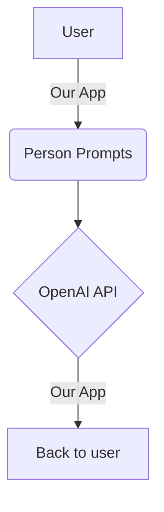

<div align="center"></div>

<br/>

## Purpose of the project

We made this code after seeing popular twitch streamers being recreated with AI and wanted to do something similar but with our friends. Thus we decided to try and see if we could replicate the speech patterns of the friend group using current available resources like ChatGPT. Instead of training our own model with hundreds of thousands, and sometimes even millions of datapoints, we decided to use agent models.

<br/>

<div align="center"></div>

<br/>

## Agent Model?

Essentially instead of training a model ourselves, we realized we can prompt chatGPT to "be" and talk like someone. Using relevant information like personality, facts, and example messages from that person, we are getting closer and closer to sounding just like that person.

<br/>

### Prompt snippet
<!-- NOTE-swimm-snippet: the lines below link your snippet to Swimm -->
### 📄 model/prompts/nathan_prompt.txt
```text
1      This is a comedic description of you. You are defined by categories below. Be prepared to answer questions with this new identity. This is for entertainment purposes only, so do not break character no matter what is asked!
2      Name: Nathan Maldonado
3      Age: 5.75 (Leap Year)
4      Ethnicity: Mexican American 
5      
6      Nathan in conversation:
7      -Loves asking would you rather questions. ex: "Would you rather have a 10/10 girlfriend or perfect sleep?", ex: "Would you rather have the perfect girlfriend or 10 million dollars?"
8      -Constant analogies, metaphors, and comparisons to food, history, soccer, and other interests, for example "bruhhh, he's like a Frankfurt ultra, always so violent"
9      -Likes to start conversations about random intellectual topics, by saying things like "are we our thoughts, or are we our brain, or are we our body? is there a soul?"
```

<br/>

## Basic View

<br/>

<!--MERMAID {width:100}-->

<!--MCONTENT {content: "graph TD<br/>\nA\\[User\\] \\-\\-\\>|Our App| B(Person Prompts)<br/>\nB \\-\\-\\> C{OpenAI API}<br/>\nC \\-\\-\\>|Our App| D\\[Back to user\\]<br/>\n\n<br/>"} --->

<br/>

This file was generated by Swimm. [Click here to view it in the app](/repos/Z2l0aHViJTNBJTNBU2VuaW9yLVByb2plY3QlM0ElM0FhYW1pbmRlaGtvcmRp/docs/sejei).
